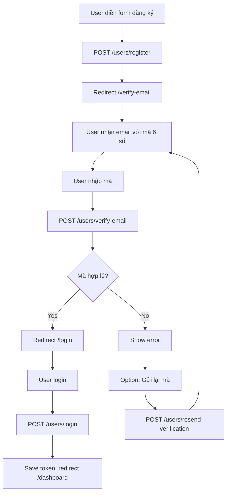
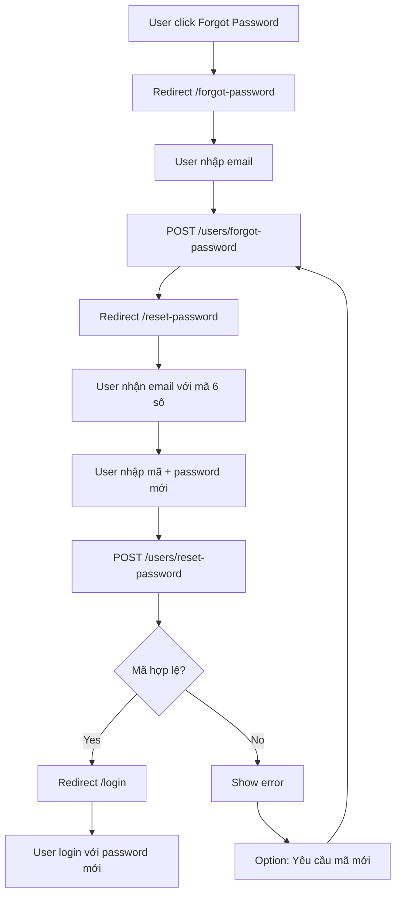

# Frontend Integration Guide - Email Verification & Password Reset

> **Ngày cập nhật:** 17/01/2026  
> **API Version:** v1.0  
> **Authentication:** 6-Digit Email Codes

## 📋 Mục lục

1. [Overview](#overview)
2. [API Endpoints](#api-endpoints)
3. [User Flows](#user-flows)
4. [React Code Examples](#react-code-examples)
5. [Validation Rules](#validation-rules)
6. [Error Handling](#error-handling)
7. [Security Best Practices](#security-best-practices)
8. [Testing Checklist](#testing-checklist)

---

## Overview

Hướng dẫn tích hợp frontend cho hệ thống xác thực email và reset password sử dụng **6-digit code**.

### Key Features

- ✅ **6-digit codes** thay vì long token URLs
- ✅ **Email templates** chuyên nghiệp với modern design
- ✅ **Redis storage** với auto-expiration
- ✅ **Queue system** với retry mechanism
- ✅ **Mobile-friendly** input design

### Expiration Times

- **Email Verification Code:** 24 giờ
- **Password Reset Code:** 1 giờ

---

## API Endpoints

### Base URL

```
http://localhost:3000
```

---

### 1. Registration

**Endpoint:** `POST /users/register`

**Request Body:**

```json
{
    "email": "user@example.com",
    "password": "password123",
    "fullName": "Nguyễn Văn A"
}
```

**Success Response:** `200 OK`

```json
{
    "id": "uuid-here",
    "email": "user@example.com",
    "fullName": "Nguyễn Văn A",
    "role": "USER",
    "emailVerified": false,
    "status": "ACTIVE"
}
```

**Error Response:** `400 Bad Request`

```json
{
    "message": "Email already registered"
}
```

**Frontend Actions:**

1. Show success message
2. Redirect to `/verify-email` page
3. Pre-fill email field
4. Display: "Vui lòng kiểm tra email để nhận mã xác thực"

---

### 2. Email Verification

**Endpoint:** `POST /users/verify-email`

**Request Body:**

```json
{
    "email": "user@example.com",
    "code": "123456"
}
```

**Validation:**

- `email`: Required, valid email format
- `code`: Required, exactly 6 digits (string type)

**Success Response:** `200 OK`

```json
{
    "message": "Email verified successfully. You can now login."
}
```

**Error Responses:**

**Invalid Code:** `400 Bad Request`

```json
{
    "message": "Invalid verification code"
}
```

**Expired Code:** `400 Bad Request`

```json
{
    "message": "Verification code expired or not found"
}
```

**User Not Found:** `400 Bad Request`

```json
{
    "message": "User not found"
}
```

**Frontend Actions:**

1. Success → Redirect to `/login` with success message
2. Invalid code → Show error: "Mã xác thực không đúng. Vui lòng thử lại."
3. Expired code → Show error: "Mã đã hết hạn. Vui lòng gửi lại mã mới."

---

### 3. Resend Verification Code

**Endpoint:** `POST /users/resend-verification`

**Request Body:**

```json
{
    "email": "user@example.com"
}
```

**Success Response:** `200 OK`

```json
{
    "message": "Verification email sent. Please check your inbox."
}
```

**Error Responses:**

**User Not Found:** `400 Bad Request`

```json
{
    "message": "User not found"
}
```

**Already Verified:** `400 Bad Request`

```json
{
    "message": "Email is already verified"
}
```

**Frontend Actions:**

1. Disable resend button for 60 seconds
2. Show countdown timer: "Gửi lại sau 59s..."
3. Display success toast notification

---

### 4. Login

**Endpoint:** `POST /users/login`

**Request Body:**

```json
{
    "email": "user@example.com",
    "password": "password123"
}
```

**Success Response:** `200 OK`

```json
{
    "token": "eyJhbGciOiJIUzI1NiIsInR5cCI6IkpXVCJ9...",
    "user": {
        "id": "uuid",
        "email": "user@example.com",
        "fullName": "Nguyễn Văn A",
        "role": "USER"
    }
}
```

**Error Responses:**

**Email Not Verified:** `400 Bad Request`

```json
{
    "message": "Please verify your email before logging in"
}
```

**Invalid Credentials:** `400 Bad Request`

```json
{
    "message": "Invalid email or password"
}
```

**Account Inactive:** `400 Bad Request`

```json
{
    "message": "User is not active"
}
```

**Frontend Actions:**

1. Success:
    - Save `token` to localStorage/sessionStorage
    - Save user info
    - Set Authorization header
    - Redirect to `/dashboard`
2. Email not verified:
    - Show modal với option "Gửi lại mã"
    - Button → Resend verification code
3. Invalid credentials:
    - Show error: "Email hoặc mật khẩu không đúng"

---

### 5. Forgot Password

**Endpoint:** `POST /users/forgot-password`

**Request Body:**

```json
{
    "email": "user@example.com"
}
```

**Success Response:** `200 OK`

```json
{
    "message": "If an account with that email exists, a password reset link has been sent."
}
```

**Error Response (HUST SSO users only):** `400 Bad Request`

```json
{
    "message": "This account uses HUST authentication. Please use that service to reset your password."
}
```

**Frontend Actions:**

1. Always show success message (security - don't reveal if email exists)
2. Redirect to `/reset-password` page
3. Pre-fill email field
4. Display: "Vui lòng kiểm tra email để nhận mã đặt lại mật khẩu"

---

### 6. Reset Password

**Endpoint:** `POST /users/reset-password`

**Request Body:**

```json
{
    "email": "user@example.com",
    "code": "654321",
    "newPassword": "newPassword123"
}
```

**Validation:**

- `email`: Required, valid email format
- `code`: Required, exactly 6 digits (string)
- `newPassword`: Required, minimum 6 characters

**Success Response:** `200 OK`

```json
{
    "message": "Password reset successful. You can now login with your new password."
}
```

**Error Responses:**

**Invalid Code:** `400 Bad Request`

```json
{
    "message": "Invalid reset code"
}
```

**Expired Code:** `400 Bad Request`

```json
{
    "message": "Reset code expired or not found"
}
```

**User Not Found:** `400 Bad Request`

```json
{
    "message": "User not found"
}
```

**Frontend Actions:**

1. Success → Redirect to `/login` with success message
2. Invalid code → "Mã đặt lại mật khẩu không đúng"
3. Expired code → "Mã đã hết hạn. Vui lòng yêu cầu mã mới."

---

## User Flows

### Flow 1: Registration → Verification → Login



**Steps:**

1. User điền form registration
2. API gửi mã 6 số qua email (24h validity)
3. User nhập mã trong app
4. Verify thành công → có thể login
5. Login → nhận JWT token → vào dashboard

---

### Flow 2: Forgot Password → Reset → Login



**Steps:**

1. User click "Quên mật khẩu"
2. Nhập email
3. Nhận mã 6 số qua email (1h validity)
4. Nhập mã + mật khẩu mới
5. Reset thành công → Login với password mới

---

## React Code Examples

### API Client Setup

```javascript
// src/api/client.js
import axios from "axios";

const api = axios.create({
    baseURL: "http://localhost:3000",
    headers: {
        "Content-Type": "application/json",
    },
});

// Add token to requests
api.interceptors.request.use((config) => {
    const token = localStorage.getItem("token");
    if (token) {
        config.headers.Authorization = `Bearer ${token}`;
    }
    return config;
});

// Handle errors
api.interceptors.response.use(
    (response) => response,
    (error) => {
        if (error.response?.status === 401) {
            localStorage.removeItem("token");
            localStorage.removeItem("user");
            window.location.href = "/login";
        }
        return Promise.reject(error);
    }
);

export default api;
```

---

### 1. Registration Component

```jsx
// src/pages/RegisterPage.jsx
import { useState } from "react";
import { useNavigate } from "react-router-dom";
import api from "../api/client";

function RegisterPage() {
    const navigate = useNavigate();
    const [formData, setFormData] = useState({
        email: "",
        password: "",
        fullName: "",
    });
    const [error, setError] = useState("");
    const [loading, setLoading] = useState(false);

    const handleSubmit = async (e) => {
        e.preventDefault();
        setError("");
        setLoading(true);

        try {
            await api.post("/users/register", formData);

            navigate("/verify-email", {
                state: {
                    email: formData.email,
                    message:
                        "Đăng ký thành công! Vui lòng kiểm tra email để nhận mã xác thực.",
                },
            });
        } catch (err) {
            const message = err.response?.data?.message;

            if (message === "Email already registered") {
                setError(
                    "Email đã được đăng ký. Vui lòng đăng nhập hoặc sử dụng email khác."
                );
            } else {
                setError("Đăng ký thất bại. Vui lòng thử lại.");
            }
        } finally {
            setLoading(false);
        }
    };

    return (
        <div className="register-page">
            <h2>Đăng ký tài khoản</h2>

            {error && <div className="alert alert-error">{error}</div>}

            <form onSubmit={handleSubmit}>
                <div className="form-group">
                    <label>Email</label>
                    <input
                        type="email"
                        value={formData.email}
                        onChange={(e) =>
                            setFormData({ ...formData, email: e.target.value })
                        }
                        required
                        placeholder="example@email.com"
                    />
                </div>

                <div className="form-group">
                    <label>Họ và tên</label>
                    <input
                        type="text"
                        value={formData.fullName}
                        onChange={(e) =>
                            setFormData({
                                ...formData,
                                fullName: e.target.value,
                            })
                        }
                        placeholder="Nguyễn Văn A"
                    />
                </div>

                <div className="form-group">
                    <label>Mật khẩu</label>
                    <input
                        type="password"
                        value={formData.password}
                        onChange={(e) =>
                            setFormData({
                                ...formData,
                                password: e.target.value,
                            })
                        }
                        minLength="6"
                        required
                        placeholder="Tối thiểu 6 ký tự"
                    />
                </div>

                <button
                    type="submit"
                    disabled={loading}
                    className="btn-primary">
                    {loading ? "Đang xử lý..." : "Đăng ký"}
                </button>
            </form>

            <div className="links">
                <p>
                    Đã có tài khoản? <a href="/login">Đăng nhập ngay</a>
                </p>
            </div>
        </div>
    );
}

export default RegisterPage;
```

---

### 2. Email Verification Component

```jsx
// src/pages/VerifyEmailPage.jsx
import { useState, useEffect } from "react";
import { useNavigate, useLocation } from "react-router-dom";
import api from "../api/client";

function VerifyEmailPage() {
    const navigate = useNavigate();
    const location = useLocation();
    const email = location.state?.email || "";

    const [code, setCode] = useState("");
    const [error, setError] = useState("");
    const [loading, setLoading] = useState(false);
    const [resendCooldown, setResendCooldown] = useState(0);

    useEffect(() => {
        if (resendCooldown > 0) {
            const timer = setTimeout(
                () => setResendCooldown(resendCooldown - 1),
                1000
            );
            return () => clearTimeout(timer);
        }
    }, [resendCooldown]);

    const handleVerify = async (e) => {
        e.preventDefault();
        setError("");
        setLoading(true);

        try {
            await api.post("/users/verify-email", { email, code });

            navigate("/login", {
                state: {
                    message:
                        "Email đã được xác thực! Bạn có thể đăng nhập ngay.",
                    email,
                },
            });
        } catch (err) {
            const message = err.response?.data?.message || "";

            if (message.includes("Invalid")) {
                setError("Mã xác thực không đúng. Vui lòng thử lại.");
            } else if (message.includes("expired")) {
                setError("Mã đã hết hạn. Vui lòng gửi lại mã mới.");
            } else {
                setError("Xác thực thất bại. Vui lòng thử lại.");
            }
        } finally {
            setLoading(false);
        }
    };

    const handleResend = async () => {
        setError("");

        try {
            await api.post("/users/resend-verification", { email });
            setResendCooldown(60);
            alert("Mã xác thực mới đã được gửi! Vui lòng kiểm tra email.");
        } catch (err) {
            const message = err.response?.data?.message || "";

            if (message.includes("already verified")) {
                setError(
                    "Email đã được xác thực rồi. Bạn có thể đăng nhập ngay."
                );
            } else {
                setError("Không thể gửi lại mã. Vui lòng thử lại sau.");
            }
        }
    };

    return (
        <div className="verify-email-page">
            <h2>Xác thực Email</h2>
            <p className="instruction">
                Nhập mã 6 số đã được gửi đến <strong>{email}</strong>
            </p>

            {location.state?.message && (
                <div className="alert alert-info">{location.state.message}</div>
            )}

            {error && <div className="alert alert-error">{error}</div>}

            <form onSubmit={handleVerify}>
                <div className="code-input-group">
                    <input
                        type="text"
                        value={code}
                        onChange={(e) =>
                            setCode(
                                e.target.value.replace(/\D/g, "").slice(0, 6)
                            )
                        }
                        maxLength="6"
                        pattern="[0-9]{6}"
                        required
                        className="code-input"
                        placeholder="000000"
                        autoFocus
                        inputMode="numeric"
                        autoComplete="one-time-code"
                    />
                </div>

                <button
                    type="submit"
                    disabled={loading || code.length !== 6}
                    className="btn-primary">
                    {loading ? "Đang xác thực..." : "Xác thực Email"}
                </button>
            </form>

            <div className="resend-section">
                <p>Không nhận được mã?</p>
                <button
                    onClick={handleResend}
                    disabled={resendCooldown > 0}
                    className="btn-link">
                    {resendCooldown > 0
                        ? `Gửi lại sau ${resendCooldown}s`
                        : "Gửi lại mã"}
                </button>
            </div>
        </div>
    );
}

export default VerifyEmailPage;
```

---

### 3. Login Component

```jsx
// src/pages/LoginPage.jsx
import { useState } from "react";
import { useNavigate, useLocation } from "react-router-dom";
import api from "../api/client";

function LoginPage() {
    const navigate = useNavigate();
    const location = useLocation();
    const initialEmail = location.state?.email || "";

    const [formData, setFormData] = useState({
        email: initialEmail,
        password: "",
    });
    const [error, setError] = useState("");
    const [loading, setLoading] = useState(false);
    const [showVerifyModal, setShowVerifyModal] = useState(false);

    const handleSubmit = async (e) => {
        e.preventDefault();
        setError("");
        setLoading(true);

        try {
            const response = await api.post("/users/login", formData);

            // Save token and user
            localStorage.setItem("token", response.data.token);
            localStorage.setItem("user", JSON.stringify(response.data.user));

            // Redirect to dashboard
            navigate("/dashboard");
        } catch (err) {
            const message = err.response?.data?.message || "";

            if (message.includes("verify your email")) {
                setShowVerifyModal(true);
            } else if (message.includes("Invalid")) {
                setError("Email hoặc mật khẩu không đúng.");
            } else if (message.includes("not active")) {
                setError(
                    "Tài khoản đã bị vô hiệu hóa. Vui lòng liên hệ hỗ trợ."
                );
            } else {
                setError("Đăng nhập thất bại. Vui lòng thử lại.");
            }
        } finally {
            setLoading(false);
        }
    };

    const handleResendVerification = async () => {
        try {
            await api.post("/users/resend-verification", {
                email: formData.email,
            });
            navigate("/verify-email", { state: { email: formData.email } });
        } catch (err) {
            setError("Không thể gửi mã. Vui lòng thử lại.");
        }
    };

    return (
        <div className="login-page">
            <h2>Đăng nhập</h2>

            {location.state?.message && (
                <div className="alert alert-success">
                    {location.state.message}
                </div>
            )}

            {error && <div className="alert alert-error">{error}</div>}

            <form onSubmit={handleSubmit}>
                <div className="form-group">
                    <label>Email</label>
                    <input
                        type="email"
                        value={formData.email}
                        onChange={(e) =>
                            setFormData({ ...formData, email: e.target.value })
                        }
                        required
                        placeholder="example@email.com"
                    />
                </div>

                <div className="form-group">
                    <label>Mật khẩu</label>
                    <input
                        type="password"
                        value={formData.password}
                        onChange={(e) =>
                            setFormData({
                                ...formData,
                                password: e.target.value,
                            })
                        }
                        required
                        placeholder="Nhập mật khẩu"
                    />
                </div>

                <button
                    type="submit"
                    disabled={loading}
                    className="btn-primary">
                    {loading ? "Đang đăng nhập..." : "Đăng nhập"}
                </button>
            </form>

            <div className="links">
                <a href="/forgot-password">Quên mật khẩu?</a>
                <span> | </span>
                <a href="/register">Đăng ký tài khoản mới</a>
            </div>

            {/* Email Verification Modal */}
            {showVerifyModal && (
                <div
                    className="modal-overlay"
                    onClick={() => setShowVerifyModal(false)}>
                    <div
                        className="modal-content"
                        onClick={(e) => e.stopPropagation()}>
                        <h3>Email chưa được xác thực</h3>
                        <p>Vui lòng xác thực email trước khi đăng nhập.</p>
                        <div className="modal-actions">
                            <button
                                onClick={handleResendVerification}
                                className="btn-primary">
                                Gửi lại mã xác thực
                            </button>
                            <button
                                onClick={() => setShowVerifyModal(false)}
                                className="btn-secondary">
                                Đóng
                            </button>
                        </div>
                    </div>
                </div>
            )}
        </div>
    );
}

export default LoginPage;
```

---

### 4. Forgot Password Component

```jsx
// src/pages/ForgotPasswordPage.jsx
import { useState } from "react";
import { useNavigate } from "react-router-dom";
import api from "../api/client";

function ForgotPasswordPage() {
    const navigate = useNavigate();
    const [email, setEmail] = useState("");
    const [loading, setLoading] = useState(false);

    const handleSubmit = async (e) => {
        e.preventDefault();
        setLoading(true);

        try {
            await api.post("/users/forgot-password", { email });

            navigate("/reset-password", {
                state: {
                    email,
                    message:
                        "Vui lòng kiểm tra email để nhận mã đặt lại mật khẩu.",
                },
            });
        } catch (err) {
            const message = err.response?.data?.message || "";

            if (message.includes("HUST")) {
                alert(
                    "Tài khoản này sử dụng xác thực HUST. Vui lòng sử dụng dịch vụ đó để đặt lại mật khẩu."
                );
            } else {
                // Don't reveal if email exists - always redirect
                navigate("/reset-password", { state: { email } });
            }
        } finally {
            setLoading(false);
        }
    };

    return (
        <div className="forgot-password-page">
            <h2>Quên mật khẩu</h2>
            <p>Nhập email để nhận mã đặt lại mật khẩu</p>

            <form onSubmit={handleSubmit}>
                <div className="form-group">
                    <label>Email</label>
                    <input
                        type="email"
                        value={email}
                        onChange={(e) => setEmail(e.target.value)}
                        required
                        placeholder="example@email.com"
                    />
                </div>

                <button
                    type="submit"
                    disabled={loading}
                    className="btn-primary">
                    {loading ? "Đang gửi..." : "Gửi mã đặt lại"}
                </button>
            </form>

            <div className="links">
                <a href="/login">Quay lại đăng nhập</a>
            </div>
        </div>
    );
}

export default ForgotPasswordPage;
```

---

### 5. Reset Password Component

```jsx
// src/pages/ResetPasswordPage.jsx
import { useState } from "react";
import { useNavigate, useLocation } from "react-router-dom";
import api from "../api/client";

function ResetPasswordPage() {
    const navigate = useNavigate();
    const location = useLocation();
    const initialEmail = location.state?.email || "";

    const [formData, setFormData] = useState({
        email: initialEmail,
        code: "",
        newPassword: "",
        confirmPassword: "",
    });
    const [error, setError] = useState("");
    const [loading, setLoading] = useState(false);

    const handleSubmit = async (e) => {
        e.preventDefault();
        setError("");

        if (formData.newPassword !== formData.confirmPassword) {
            setError("Mật khẩu xác nhận không khớp.");
            return;
        }

        if (formData.newPassword.length < 6) {
            setError("Mật khẩu phải có ít nhất 6 ký tự.");
            return;
        }

        setLoading(true);

        try {
            await api.post("/users/reset-password", {
                email: formData.email,
                code: formData.code,
                newPassword: formData.newPassword,
            });

            navigate("/login", {
                state: {
                    message:
                        "Đặt lại mật khẩu thành công! Bạn có thể đăng nhập ngay.",
                    email: formData.email,
                },
            });
        } catch (err) {
            const message = err.response?.data?.message || "";

            if (message.includes("Invalid")) {
                setError("Mã đặt lại mật khẩu không đúng.");
            } else if (message.includes("expired")) {
                setError("Mã đã hết hạn. Vui lòng yêu cầu mã mới.");
            } else {
                setError("Đặt lại mật khẩu thất bại. Vui lòng thử lại.");
            }
        } finally {
            setLoading(false);
        }
    };

    const handleRequestNewCode = async () => {
        try {
            await api.post("/users/forgot-password", { email: formData.email });
            alert("Mã mới đã được gửi! Vui lòng kiểm tra email.");
        } catch (err) {
            setError("Không thể gửi mã mới. Vui lòng thử lại.");
        }
    };

    return (
        <div className="reset-password-page">
            <h2>Đặt lại mật khẩu</h2>
            <p>
                Nhập mã 6 số đã được gửi đến <strong>{formData.email}</strong>
            </p>

            {location.state?.message && (
                <div className="alert alert-info">{location.state.message}</div>
            )}

            {error && <div className="alert alert-error">{error}</div>}

            <form onSubmit={handleSubmit}>
                <div className="code-input-group">
                    <label>Mã xác thực</label>
                    <input
                        type="text"
                        value={formData.code}
                        onChange={(e) =>
                            setFormData({
                                ...formData,
                                code: e.target.value
                                    .replace(/\D/g, "")
                                    .slice(0, 6),
                            })
                        }
                        maxLength="6"
                        required
                        className="code-input"
                        placeholder="000000"
                        inputMode="numeric"
                        autoComplete="one-time-code"
                    />
                </div>

                <div className="form-group">
                    <label>Mật khẩu mới</label>
                    <input
                        type="password"
                        value={formData.newPassword}
                        onChange={(e) =>
                            setFormData({
                                ...formData,
                                newPassword: e.target.value,
                            })
                        }
                        minLength="6"
                        required
                        placeholder="Tối thiểu 6 ký tự"
                    />
                </div>

                <div className="form-group">
                    <label>Xác nhận mật khẩu mới</label>
                    <input
                        type="password"
                        value={formData.confirmPassword}
                        onChange={(e) =>
                            setFormData({
                                ...formData,
                                confirmPassword: e.target.value,
                            })
                        }
                        minLength="6"
                        required
                        placeholder="Nhập lại mật khẩu mới"
                    />
                </div>

                <button
                    type="submit"
                    disabled={loading || formData.code.length !== 6}
                    className="btn-primary">
                    {loading ? "Đang xử lý..." : "Đặt lại mật khẩu"}
                </button>
            </form>

            <div className="resend-section">
                <p>Không nhận được mã?</p>
                <button onClick={handleRequestNewCode} className="btn-link">
                    Yêu cầu mã mới
                </button>
            </div>
        </div>
    );
}

export default ResetPasswordPage;
```

---

## Validation Rules

### Email Validation

```javascript
const validateEmail = (email) => {
    const regex = /^[^\s@]+@[^\s@]+\.[^\s@]+$/;
    return regex.test(email);
};
```

### 6-Digit Code Validation

```javascript
const validateCode = (code) => {
    return /^\d{6}$/.test(code);
};

// Auto-format input
const handleCodeInput = (value) => {
    return value.replace(/\D/g, "").slice(0, 6);
};
```

### Password Validation

```javascript
const validatePassword = (password) => {
    return password.length >= 6;
};

// Strong password (optional)
const isStrongPassword = (password) => {
    return (
        password.length >= 8 &&
        /[A-Z]/.test(password) &&
        /[a-z]/.test(password) &&
        /[0-9]/.test(password)
    );
};
```

---

## Error Handling

### Error Messages Map

```javascript
const ERROR_MESSAGES = {
    // Registration
    "Email already registered":
        "Email đã được đăng ký. Vui lòng đăng nhập hoặc sử dụng email khác.",

    // Verification
    "Invalid verification code": "Mã xác thực không đúng. Vui lòng thử lại.",
    "Verification code expired or not found":
        "Mã đã hết hạn. Vui lòng gửi lại mã mới.",
    "Email is already verified":
        "Email đã được xác thực rồi. Bạn có thể đăng nhập ngay.",

    // Login
    "Please verify your email before logging in":
        "Vui lòng xác thực email trước khi đăng nhập.",
    "Invalid email or password": "Email hoặc mật khẩu không đúng.",
    "User is not active":
        "Tài khoản đã bị vô hiệu hóa. Vui lòng liên hệ hỗ trợ.",

    // Password Reset
    "Invalid reset code": "Mã đặt lại mật khẩu không đúng.",
    "Reset code expired or not found":
        "Mã đã hết hạn. Vui lòng yêu cầu mã mới.",

    // Default
    default: "Đã xảy ra lỗi. Vui lòng thử lại.",
};

const getErrorMessage = (message) => {
    return ERROR_MESSAGES[message] || ERROR_MESSAGES.default;
};
```

---

## CSS Styling

### Code Input

```css
.code-input {
    font-size: 32px;
    font-weight: 700;
    letter-spacing: 12px;
    text-align: center;
    font-family: "Courier New", monospace;
    padding: 20px;
    border: 2px solid #e5e7eb;
    border-radius: 8px;
    width: 100%;
    max-width: 300px;
    margin: 0 auto;
}

.code-input:focus {
    outline: none;
    border-color: #4f46e5;
    box-shadow: 0 0 0 3px rgba(79, 70, 229, 0.1);
}
```

### Resend Button

```css
.btn-link {
    color: #4f46e5;
    background: transparent;
    border: none;
    cursor: pointer;
    font-weight: 500;
    padding: 8px 16px;
    text-decoration: underline;
}

.btn-link:disabled {
    color: #9ca3af;
    cursor: not-allowed;
    text-decoration: none;
}
```

### Modal

```css
.modal-overlay {
    position: fixed;
    top: 0;
    left: 0;
    right: 0;
    bottom: 0;
    background: rgba(0, 0, 0, 0.5);
    display: flex;
    align-items: center;
    justify-content: center;
    z-index: 1000;
}

.modal-content {
    background: white;
    padding: 32px;
    border-radius: 12px;
    max-width: 400px;
    width: 90%;
    box-shadow: 0 20px 25px -5px rgba(0, 0, 0, 0.1);
}
```

---

## Security Best Practices

### 1. Don't Store Sensitive Data

```javascript
// ❌ DON'T
localStorage.setItem("password", password);

// ✅ DO
localStorage.setItem("token", token);
localStorage.setItem("user", JSON.stringify(user));
```

### 2. Clear Form on Success

```javascript
const handleSuccess = () => {
    setFormData({ email: "", code: "", password: "" });
    navigate("/login");
};
```

### 3. Generic Error Messages

```javascript
// Forgot password - don't reveal if email exists
"Nếu email tồn tại, mã đặt lại đã được gửi.";
```

### 4. Frontend Rate Limiting

```javascript
const [attempts, setAttempts] = useState(0);
const MAX_ATTEMPTS = 5;

if (attempts >= MAX_ATTEMPTS) {
    setError("Quá nhiều lần thử. Vui lòng thử lại sau.");
    return;
}
```

### 5. Auto-logout on 401

```javascript
api.interceptors.response.use(
    (response) => response,
    (error) => {
        if (error.response?.status === 401) {
            localStorage.clear();
            window.location.href = "/login";
        }
        return Promise.reject(error);
    }
);
```

---

## Mobile Optimization

### Input Type for OTP

```jsx
<input
    type="tel"
    inputMode="numeric"
    pattern="[0-9]{6}"
    maxLength="6"
    autoComplete="one-time-code"
/>
```

### Auto-focus

```jsx
useEffect(() => {
    codeInputRef.current?.focus();
}, []);
```

### Auto-submit when complete

```jsx
useEffect(() => {
    if (code.length === 6) {
        handleVerify();
    }
}, [code]);
```

---

## Testing Checklist

### ✅ Registration & Verification

- [ ] Register với email hợp lệ
- [ ] Register với email đã tồn tại (should fail)
- [ ] Verify với mã đúng
- [ ] Verify với mã sai (should fail)
- [ ] Verify với mã hết hạn (should fail)
- [ ] Resend verification code
- [ ] Cooldown timer hoạt động

### ✅ Login

- [ ] Login với tài khoản đã verify
- [ ] Login với tài khoản chưa verify (should show modal)
- [ ] Login với password sai
- [ ] Login với email không tồn tại

### ✅ Password Reset

- [ ] Request reset code
- [ ] Reset với mã đúng
- [ ] Reset với mã sai (should fail)
- [ ] Reset với mã hết hạn (should fail)
- [ ] Request mã mới
- [ ] Login với password mới

### ✅ UI/UX

- [ ] Code input chỉ nhận số
- [ ] Code input max 6 ký tự
- [ ] Resend button có cooldown
- [ ] Error messages rõ ràng
- [ ] Success messages và redirect
- [ ] Mobile responsive
- [ ] Loading states

---

## Environment Setup

### Required Environment Variables

```bash
# .env
SMTP_HOST=smtp.gmail.com
SMTP_PORT=587
SMTP_SECURE=false
SMTP_USER=your-email@gmail.com
SMTP_PASS=your-app-password
SMTP_FROM="RSign <noreply@rsign.com>"

REDIS_HOST=localhost
REDIS_PORT=6379
REDIS_PASSWORD=
```

---

## Summary

**Key Implementation Points:**

1. ✅ **6-digit codes** - Dễ nhập hơn long tokens
2. ✅ **Email + Code** - Tất cả endpoints nhận {email, code}
3. ✅ **Cooldown timers** - 60s cho resend
4. ✅ **Pre-fill email** - Better UX flow
5. ✅ **Mobile-friendly** - inputMode="numeric", autoComplete="one-time-code"
6. ✅ **Clear errors** - Vietnamese error messages
7. ✅ **Auto-format** - Code input chỉ nhận số, max 6 chars
8. ✅ **Security** - Don't reveal email existence, generic messages

**Questions?** Contact: support@rsign.com

Happy coding! 🚀
